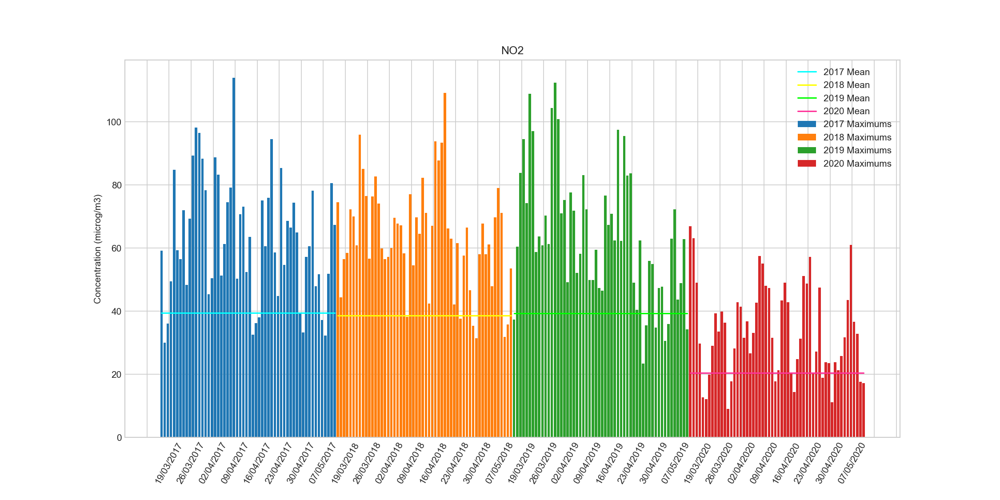
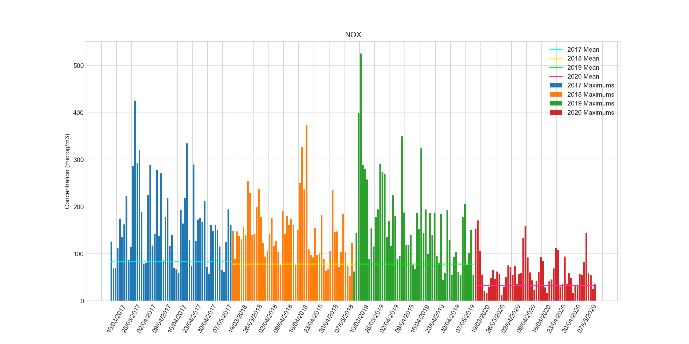
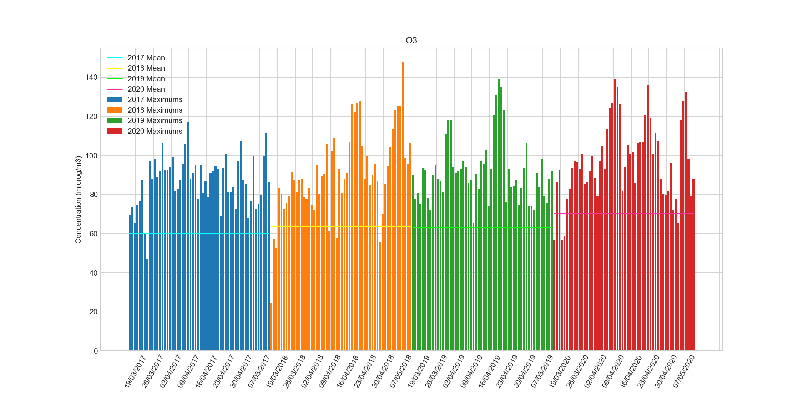
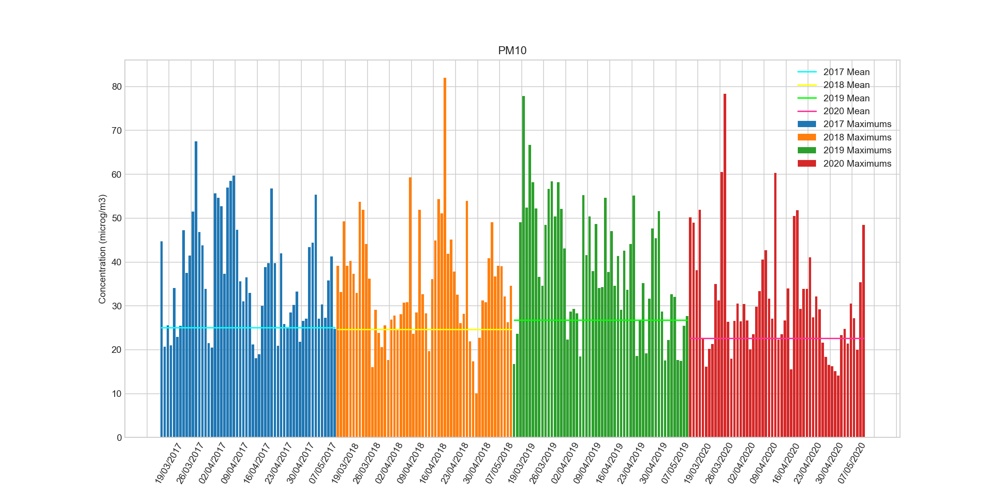
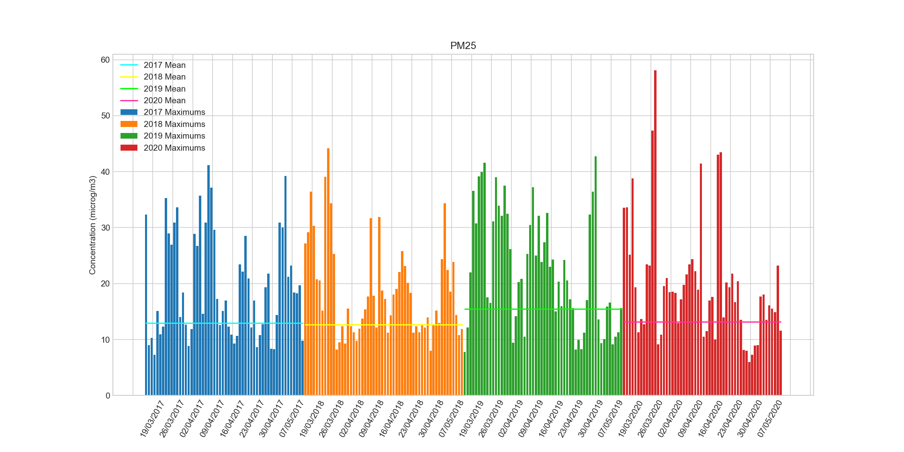

# AirQuality-Lockdown
The effect of the Lockdown on Paris Air Quality

During Covid-19 Crisis, France has been under lockdown from 17 March to 11 May 2020. Road traffic has been reduced to its minimum.
As a consequence, it's a unique opportunity to study air pollutants data and to compare with previous years.

The study consists in a Python Jupyter Notebook.

A small [article](https://github.com/krusty-is-cool/AirQuality-Lockdown/article.md) with more details is also available in french.

Data provided by [AirParif](https://www.airparif.asso.fr/).

## Results summary

Average concentrations on period (microg/m^3)

| 	| 2017 | 2018 |	2019 | 2020 |
|---|---|---|---|---|
| NO2 |	39.443204 |	38.698732 |	39.391387 |	20.440937 |
| NOX |	83.616295 |	78.604687 |	79.100019 |	32.594196 |
| O3 |	60.078404 |	63.966673 |	62.935268 |	70.354601 |
| PM10 |	25.082143 |	24.696071 |	26.737798 |	22.672113 |
| PM25 |	12.922247 |	12.692921 |	15.491656 |	13.142591 |

## Graphs

