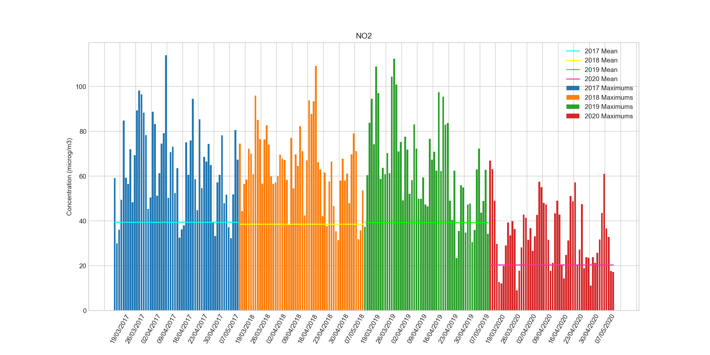
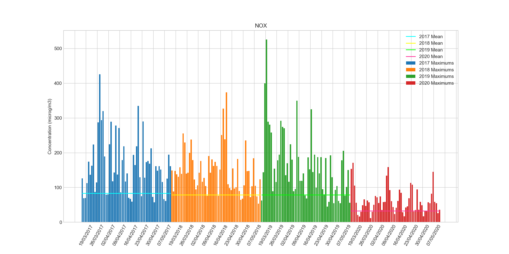
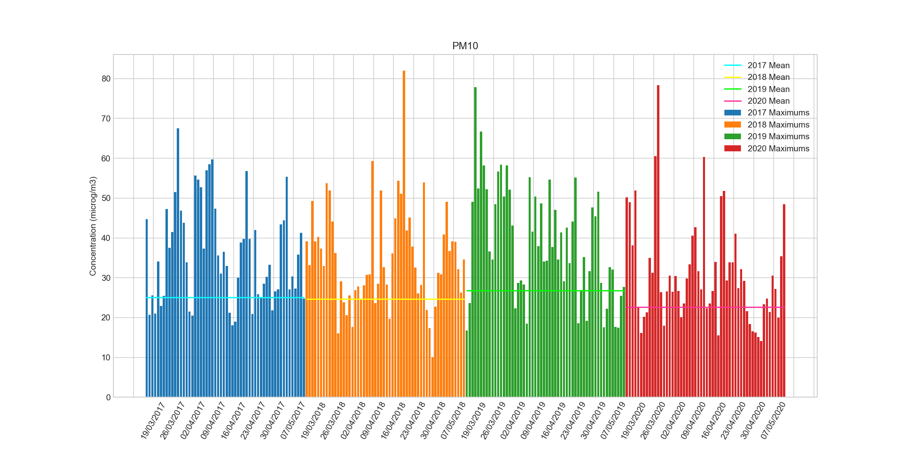
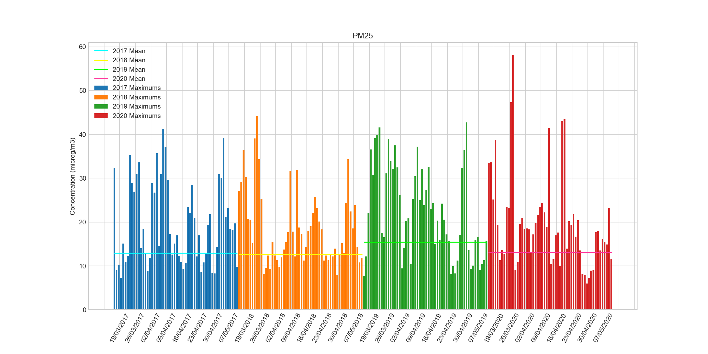

# Pollution de l'air en IDF : impact du confinement

## Un trafic réduit au minimum

Du jour au lendemain, seuls les déplacements indispensables furent autorisés. 
Les travailleurs des secteurs non indispensables à la guerre contre le Covid-19 ont été sommés de rester chez eux, en télétravail ou en chômage partiel. 
Dès lors, difficile d'observer le moindre kilomètre de bouchons sur les routes franciliennes. 
Les transports en commun font le service minimum. Jamais une telle diminution sur une période aussi longue n'avait été observée. 
Une étude sur une période d'environ 2 mois permettrait de limiter l'influence des conditions météorologiques. 
Notons que le transport aérien a également marqué le pas.

Dans les grandes agglomérations, où la pollution de l'air est une affaire de santé publique, la circulation automobile est souvent vue comme une variable d'ajustement par les pouvoirs publiques lors des pics de pollution. 
Est-ce efficace ? Peut-on estimer la responsabilité de l'automobile dans les émissions polluantes ?

Pour tenter de répondre à ces questions, nous utiliserons les données d'AirParif, l'association qui surveille la qualité de l'air en région parisienne.

## Attention aux apparences

Il est facile de s'y méprendre. Pour donner une idée de la qualité de l'air en région parisienne, AirParif, l'association qui effectue les mesures, produit un indice européen évoluant de 0 à 100 associé à une qualification de "très faible" à "très élevé". 
En regardant l'historique de cet indice pour les mois de Mars, Avril et Mai, on ne constate aucune amélioration sensible par rapport à l'année dernière. 
Exemple pour le moi d'avril :

On serait tenté de s'exclamer que la baisse du trafic n'aurait eu aucun impact sur la qualité de l'air. Pourtant on aurait tort !

L'indice est établi de manière à refléter le seuil le plus élevé atteint par l'un des polluants surveillés. Encore une fois, un petit tour sur le site d'AirParif nous permet de comprendre.

Par exemple, pour la journée du 3 juin 2020, l'indice est de 52, ce qui correspond à une qualité de l'air "moyenne". En réalité, le niveau "moyen" est seulement atteint par l'ozone (O3). Les autres polluants sont dans des niveaux "faible" ou "très faible". De plus, l'ozone est un polluant secondaire qui n'est pas directement rejeté par les habitations ou les véhicules.

Pour réellement espérer observer une évolution de la qualité de l'air avec le confinement, il faut donc étudier les concentrations de chaque polluant indépendamment.

## Polluants étudiés

Nous allons étudier l'évolution de la concentration de NO2 (dioxyde d'azote), NOx (oxydes d'azote), O3 (ozone), PM10 (particules < 10 micromètres) et PM2.5 (particules < 2.5 micromètres) sur la période 17 Mars - 11 Mai en 2017, 2018, 2019 et 2020.

### NOx

Les oxydes d'azote regroupes le monoxyde d'azote (NO) et le dioxyde d'azote (NO2) dont la concentration est mesurée indépendamment. Le monoxyde d'azote n'est pas toxique alors que le dioxyde d'azote est un gaz irritant pour les voies respiratoires. En revanche, NO et NO2 sont étroitement liés dans les transformations chimiques qui ont lieu dans l'atmosphère et passent d'un état à l'autre rapidement sous l'effet du rayonnement solaire. Notamment, ils sont responsables de la formation de d'ozone et de brouillard (smog), de particules et de pluies acides (HNO3). Les NOx sont émis lors des réactions de combustion, dans les moteurs thermiques comme dans les chaudières.

### O3

L'ozone (O3), est naturellement présent dans haute atmosphère et absorbe une partie des UV, protégeant les êtres vivants à la surface terrestre. Mais à basse altitude, il s'agit d'un gaz irritant les yeux et les bronches. C'est pourquoi il est considéré comme un polluant. L'ozone se forme lorsque le NO2 subit un rayonnement UV. Une température élevée favorise la transformation. C'est un phénomène complexe qui dépend notamment de la concentration de NOx et de d'autres espèces chimiques.

### PM

PM est un acronyme qui signifie en anglais Particulate Matter. Il désigne les particules en suspension dans l'air. On distingue plusieurs catégories, en fonction de leur taille. Nous nous intéresserons aux PM10 et au PM2.5, c'est-à-dire aux particules mesurant respectivement moins de 10 et 2,5 micromètres de diamètre. On peut parfois trouver "PM25" au lieu de "PM2.5" dans la littérature. Il s'agit de la même chose. Les PM10 sont qualifiées de "fines" et les PM2.5 "d'ultrafines".

Plus les particules sont fines, plus elles pénètre en profondeur dans les voies respiratoires. Elles sont rejetées par les moteurs à combustion interne, d'autant plus que la combustion est hétérogène. L'installation de filtres à particules à permis de grandement baisser les émissions de particules par le transport routier. Cependant, les freins et les pneumatiques en émettent également. 

Les autres conversions d'énergie par combustion sont tout autant sujets aux émissions de particules. On pense notamment au chauffage domestique, bois et fioul en tête.

Une partie des particules peut résulter de la transformation de gaz en particules. Alors que la pluie tend à fixer les particules au sol, le vent peut les en arracher et les déplacer sur de longues distances.

### Polluants non étudiés

Le monoxyde de carbone (CO) ne sera pas étudié, les stations ne le mesurant pas automatiquement. Il résulte principalement de combustions incomplètes et est oxydé dans les catalyseurs automobiles.

Les composés organiques volatiles (COV) sont émis par les arbres et l'évaporation des hydrocarbures. Ils jouent un rôle dans la formation de l'ozone et peuvent irriter les voies respiratoires.

Les émissions de dioxyde de soufre (SO2) sont fortement liées à la teneur en soufre des carburants. En Europe, la réglementation impose une teneur inférieure à 10 ppm pour l'essence et à 15 ppm pour le Diesel, des seuils très faibles.

## Résultats

A chaque instant, la moyenne des mesures de l'ensemble des stations a été calculé. On a alors une valeur toute les heure. On extrait ensuite le maximum atteint pendant la journée. Ce sont ces maximums journaliers qui sont tracé en histogrammes. D'autre part, on calcule la moyenne sur l'ensemble de la période, à partir des valeurs horaires. La nuit, pendant laquelle le niveau de pollution est plus bas qu'en journée, est donc prise en compte dans ce calcul. La moyenne sur la période est tracée en ligne continue sur chaque graphique et les résultats sont reportés dans un tableau.

| 	| 2017 | 2018 |	2019 | 2020 | Evolution Moyenne | Evolution 2019 |
|---|---|---|---|---|---|---| 
| NO2 |	39.443204 |	38.698732 |	39.391387 |	20.440937 | -47.83 % | -48.11 % |
| NOX |	83.616295 |	78.604687 |	79.100019 |	32.594196 | -59.48 % | -58.79 % |
| O3 |	60.078404 |	63.966673 |	62.935268 |	70.354601 | +12.88 % | +11.79 % |
| PM10 |	25.082143 |	24.696071 |	26.737798 |	22.672113 | -11.11 % | -15.21 % |
| PM25 |	12.922247 |	12.692921 |	15.491656 |	13.142591 | -4.08 % | -15.16 % |

